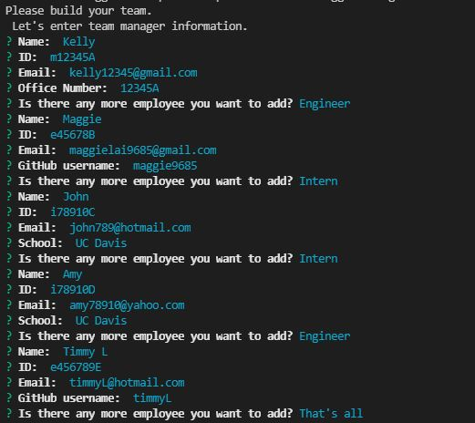

# Team-Profile-Generator

This app is to help team manager build their team profile webpage easily by answering few questions. This webpage is responsive and has workable links for any engineer's Github page. User need to first enter team manager information then it will prompt options to add more member to the team or end the app. After user choose to end the app, a HTML with team information will be generated in the "dist" folder.

#### Sample user input below. Generated HTML is under dist folder.

## Built With
* Javascript
* HTMl
* CSS/Bulma

## License
Licensed under the MIT license.

